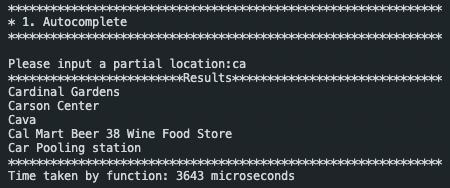
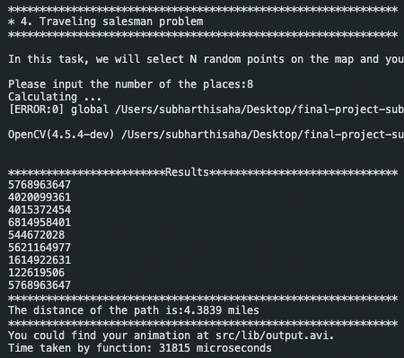
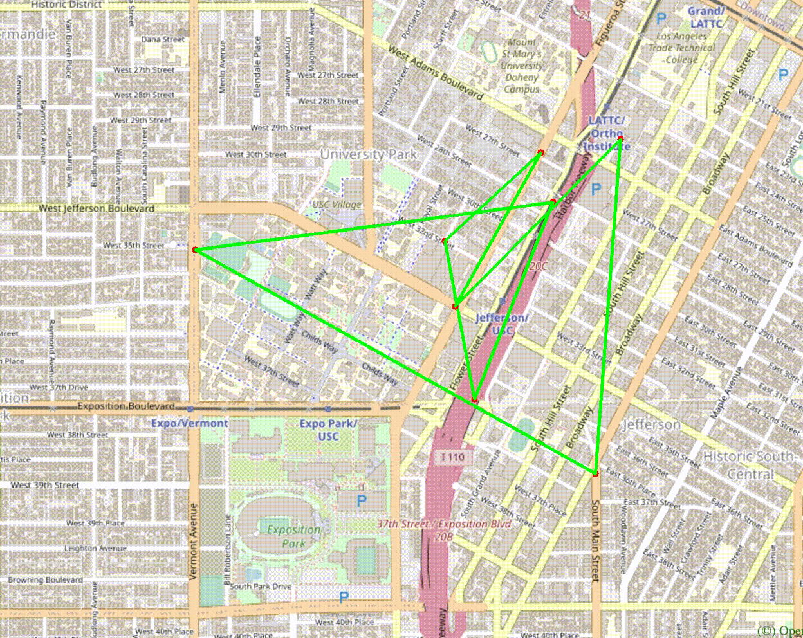

# EE538 Final Project - Fall 2021 - TrojanMap

## Team Members: 1. Subharthi Saha - 2. Orkun Bedir


## TrojanMap

<p align="center"></p>


## Step 1: Autocomplete the location name

```c++
std::vector<std::string> Autocomplete(std::string name);
```
Step 1 : Convert input (partial name) to lower case using std::transform.

Step 2 : Iterate through the map(data) and simultaneously transform every name of the node.

Step 3 : Using std::mismatch to compare the string from the data and the input.

Step 4 : If it satisfies the condition, push the result into the list of output (results).

<p align="center"></p> 

Time Complexity : O(N)

## Step 2: Find the place's Coordinates in the Map

```c++
std::pair<double, double> GetPosition(std::string name);
```
Step 1 : Set the results as pair of double values as -1,-1 for invalid case - wrong/non-existent/empty location.

Step 2 : Check for empty input, if empty then return default value of results (-1,-1).

Step 3 : Iterate through the map (data), to check if the name matches with the input.

Step 4 : Return results as a pair of latitude and longitude.

<p align="center"></p>

<p align="center"></p>

Time Complexity : O(N)

## Step 3: CalculateShortestPath between two places

```c++
std::vector<std::string> CalculateShortestPath_Dijkstra(std::string &location1_name,
                                               std::string &location2_name);
std::vector<std::string> CalculateShortestPath_Bellman_Ford(std::string &location1_name,
                                               std::string &location2_name);
```

## Shortest Path - Djikstra

Step 1 : Traverse through the graph by as you  mark nodes as “visited” starting from the source node.

Step 2 : Keep a data structure of pairs to contain the informations on distance and the previously picked (predecessor) node of each node picked.

Step 3 : Prioritize the order of traversion via picking the upcoming node that embraces the minimum distance, while being a neighbour of the node that is currently picked, as you update the distances and predecessors, accordingly.

Step 4 : Traverse through the predecessors of the nodes that were picked due to embracing the minimum distance and backtrack to get the shortest path. 

Ralphs to Target 
Output:
<p align="center"></p>
Path on Map:
<p align="center"></p>

ChickfilA to Popeyes Louisiana Kitchen
Output:
<p align="center"></p>
Path on Map:
<p align="center"></p>

Ralphs to ChickfilA
Output:
<p align="center"></p>
Path on Map:
<p align="center"></p>

Cardinal Gardens to Ralphs
Output:
<p align="center"></p>
Path on Map:
<p align="center"></p>

## Runtime Analysis for Dijkstra
<p align="center"></p>

Time Complexity : O(n^2)

## Shortest Path - Bellman-Ford

Step 1 : Setting the source intact, calculate the shortest distance that can be obtained from source to destination via only using single edge.

Step 2 : Embrace an iterative methodology, that is relax 1 more edge through each iteration and obtain the shortest distance and path given the allowed relaxation.

Step 3 : After the allowance of a specific relaxation of nodes that can be used to get the shortest path, compare the distances obtained in the version where we allow one additional edge to be used compared to the previous version. 

Step 4 : Choose the path that offers the minimum distance and if an additional node is picked after the relaxation add it to the list of predecessors.  Traverse through the predecessors and backtrack to get the shortest path.


Ralphs to Target 
Output:
<p align="center"></p>
Path on Map:
<p align="center"></p>

ChickfilA to Popeyes Louisiana Kitchen
Output:
<p align="center"></p>
Path on Map:
<p align="center"></p>

Ralphs to ChickfilA
Output:
<p align="center"></p>
Path on Map:
<p align="center"></p>

Cardinal Gardens to Ralphs
Output:
<p align="center"></p>
Path on Map:
<p align="center"></p>

## Runtime Analysis for Bellman - Ford
<p align="center"></p>

Time Complexity : O((E-1)xVxE) where E stands for the number of edges and V stands for the number of vertices.

## Runtime Comparison for Dijkstra and Bellman Ford Algorithm

<p align="center"></p>

## Step 4: The Traveling Trojan Problem (AKA Traveling Salesman!)

## Brute Force
```c++
std::pair<double, std::vector<std::vector<std::string>>> TravellingTrojan(
      std::vector<std::string> &location_ids);
```
Step 1 : Setting min_cost as DBL_MAX. Finding all possible combinations of the path and pushing the improved path to the result.

Step 2 : Recursively calling the TSP_aux which keeps updating the min_cost, cur_cost the paths and the result.

Step 3 : Push the current path if the previous distance is bigger than current distance.

Step 4 : Run till the best path is achieved. Store the path progress to get animation of improving paths is generated from the path progress.

<p align="center"></p>

<p align="center"></p>

<p align="center"></p>

Time Complexity : O(n!)

## Backtracking
```c++
std::pair<double, std::vector<std::vector<std::string>>> TravellingTrojan(
      std::vector<std::string> &location_ids);
```
Step 1 : Setting min_cost as DBL_MAX. Finding all possible combinations of the path and pushing the improved path to the result.

Step 2 : Recursively calling the TSP_aux (DFS for every node) which keeps updating the min_cost, cur_cost the paths and the result.

Step 3 : In backtracking, check if the cur_cost mid way in the path is already greater than min_cost of the previous best path. Break the current DFS if true.  

Step 4 : Run till the best path is achieved. Store the path progress to get animation of improving paths is generated from the path progress.

<p align="center"></p>

<p align="center"></p>

<p align="center"></p>

Time Complexity : O(n!)

## 2-opt
```c++
std::pair<double, std::vector<std::vector<std::string>>> TravellingTrojan_2opt(
      std::vector<std::string> &location_ids);
```
Step 1 : Setting min_cost as DBL_MAX. Finding a new path on every run till we find improved path.

Step 2 : Using two for loops to get a subpart of the path and reversing it to get a new path.

Step 3 : Checking if the new path length is better than the previous best path received, if true then pushing into results.

Step 4 : Running till there is certain level of improvement. Because of this condition we get correct solution for shorter paths. (not optimal for longer paths)

<p align="center"></p>

<p align="center"></p>

<p align="center"></p>

Time Complexity : O(n*i) where i is the times we defined non-improvements.


## TSP Runtime Comparison: 

<p align="center"></p>

## Step 5: Cycle Detection

```c++
bool CycleDetection(std::vector<double> &square);
```

Step 1 : Determine the nodes that are circumscribed by the area of interest and keep the present nodes in a map paired with an indication for being visited or not, while keeping the parent of the current node observed aside.

Step 2 : Traverse through the present nodes and if the node at hand is not visited, call the auxiliary function by passing the necessary information such as the visited map, current node of observation, the parent node at hand.

Step 3 : In the auxiliary function,  mark the current node as visited and traverse through the  neighbours of it that are inside the set area. For the unvisited neighbours include a recursive call and observe the last call’s output.

Step 4 : If the last output turns out to be true, there is a cycle in the set area.
If not, check whether the neighbour at hand is visited while not being the parent of the current node observed, or not. If confirmed, there is a cycle in the subgraph. 

<p align="center"></p>

<p align="center"></p>

<p align="center"></p>

<p align="center"></p>

<p align="center"></p>

<p align="center"></p>

<p align="center"></p>

## Runtime Analysis for Cycle Detection

<p align="center"></p>

Time Complexity : O(n^2)


## Step 6: Topological Sort

```c++
std::vector<std::string> DeliveringTrojan(std::vector<std::string> &location_names,
                                            std::vector<std::vector<std::string>> &dependencies);
```
Step 1 : Created an adjacency matrix from the input dependency file by storing it in an unordered map.

Step 2 : Created a map for storing  the indegree of all the locations from the adjacency graph. 

Step 3 : Iterating through the child of the root nodes and running DFS for every child of the root node.

Step 4 : Running DFS again for the next root node and then its children. Storing the topological sorted list in a vector simultaneously. Added cycle detection by comparing the indices of parent and child in the result vector.

Example 1 :

<p align="center"></p>

<p align="center"></p>

<p align="center"></p>

Example 2:

<p align="center"></p>

<p align="center"></p>

<p align="center"></p>

Runtime Comaprison:

<p align="center"></p>

Time Complexity : O(V+E) V - Vertices and E - Edges on the map

## Step 7: Find K closest points

```c++
std::vector<std::string> FindKClosestPoints(std::string name, int k);
```
Step 1 : Construct a priority queue of pairs where one of the pairs is reserved for the distance of the location  at hand to the source location while the other one is reserved for the corresponding locations name.

Step 2 : Traverse through the graph of locations with names, add the first k nodes to the priority queue without setting a condition. 

Step 3 : After that, if the distance of a node traversed is less than the distance of the head of the priority queue, pop from the priority queue and push the information related to the node at hand.  

Step 4 :  Keep the first index of the pairs to reserve the information on distance, so that the priority queue will act as a Max Heap. After traversion is complete, traverse through the priority queue to get the names of the  k closest points to the input location. 

<p align="center"></p>

<p align="center"></p>

<p align="center"></p>

<p align="center"></p>

<p align="center"></p>

<p align="center"></p>

## Runtime Analysis for K-Closest Points

<p align="center"></p>

Time Complexity : The best case time complexity of our function is O(n logn) whereas the worst case is O(n^2).

# Discussion and Lessons Learned

To begin with, apart from having a sufficient grasp on a variety of data structures offered by the frameworks of C++, via implementing this project from scratch, we have experienced the unique opportunity to obtain hands-on experience in making use of those frameworks, which, in turn, enabled us to develop proficiency in C++ and data structures in a concrete manner.

Most importantly, after the early days of the assignment for this project was released, the course structure developed to lead us in prospering our acknowledgements through a variety of algorithmic concepts such as Depth-first Search, Dijkstra, Bellman-Ford, Brute Force, 2-opt, Cycle Detection, Topological Sort and k-Closest Points using Max Heap which can, in fact be evaluated as the cornerstones of the theory of algorithms in Computer Science. 

As team members with backgrounds in Electrical and Computer Engineering, with the successful completion of the work packages encapsulated by this project, we are genuinely grateful to obtain a solid background in C++, Algorithms and Data Structures. 

Thank you Professor and all the TAs, for teaching the course in the best way possible. I think we both could agree that we were not proficient at C++ before joining this course. Now we are confident to say that we have learnt valuable skills from this course and have got better at C++ and implementations of its algorithms.

